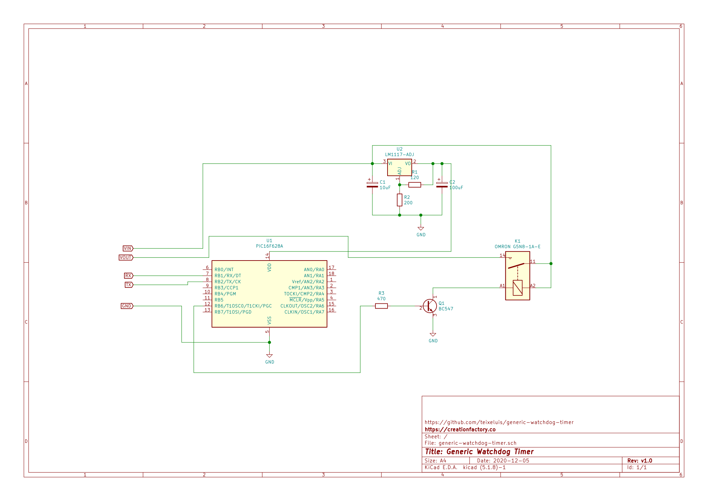

# generic-watchdog-timer

## Overview

A hardware watchdog timer for devices featuring a serial port

This project introduces a standalone watchdog timer for use with
any device featuring one availabe serial port (RS-232), and having the 
capability of periodically sending a specific string of data during its 
normal operation.

This project is an improvement over my previous project, the 
[hardware-watchdog-timer](https://github.com/teixeluis/hardware-watchdog-timer), 
given that it allows for a more complex input to cause the watchdog to reset. 
More specifically, it requires a particular string of characters to be received, 
to cause the timer to reset, and as such prevent the target device from being 
restarted.

This watchdog timer (WDT) is also capable of sending commands back to the 
target system. In the current implementation, the WDT is sending a shutdown
command to the target device, in order to allow it to shutdown properly, 
prior to being turned off.

Combined with a relay, this device is then capable of cycling the power
of the target device in order to (hard) restart it in case of failure.

This source code is accompanied with an application schematic diagram to
help in the construction of a complete unit using the PIC16F628A microcontroller
and this firmware.


## Technical description

In this implementation we are using the TIMER1 of this PIC microcontroller. From the
three regular timers available in this device, this is the only 16 bit one. For our application
it is ideal that the timer has this level of resolution, as it allows for a more
accurate definition of the duration of the timer. Depending on the application it may
also be better when compared to the 8 bit timers, in respect to the reduction of instruction
loops, when longer timer durations are required.

Whenever the timer overflows, an interrupt is generated, and our interrupt service routine (isr)
takes care of incrementing a counter variable or producing the WDT action (sending a command to
the target device and briefly turning off and on the relay) when this variable overflows. 
Then TIMER1 is restarted and the cycle repeats.

On the other hand, while the timer is running, a software loop continuously reads from the serial
port, comparing the stream of bytes with the expected string ("kiosk_wdtToken"). Everytime a
match is found, the counter variable of the timer is reset to 0, preventing the triggering of
the WDT.

I have selected this particular microcontroller due to the fact that I was already familiar 
with the architecture, and this model in particular while being cheap, has a useful feature set.
One such example is the integrated USART which besides other modes of operation, it can be 
configured to behave as a regular RS-232 serial port. 

In the simpler approach that is provided, the circuit can achieve the 9600 bps serial port speed,
and several other bit rates (see the PIC16F628A datasheet for more details).

If the user needs 115200 bps for his application, then it is only feasible to run the device
with an external clock to achieve that speed. In that case you must comment the line:

```
#define LOW_SPEED
```

that is in the main.h file.

The code will default to assuming an external (HS) clock and a serial port bitrate of 115200 bps.
Timer settings will have its values set accordingly.

One aspect to note is that if the external 20 MHz crystal is chosen, it is no longer possible to
power the device at 3.3 Volts. This has for example the implication that the serial port will
need level shifting in order to interface with the 3.3 Volt serial port from the target device.

## Prerequisites

The following software is needed for building this project:

 * MPLAB X IDE v5.45 or better;
 * XC8 toolchain (can be installed during the IDE installation process);
 * PICkit2 v2.61 in case you have an older PIC programmer. The newer versions of MPLAB X no longer support PICkit2 and older devices;

## Building and flashing

This project can be built on the MPLAB X IDE. It requires the XC8 toolchain for compiling 
the firmware image.

For building it can simply be opened in the IDE, and launch the project build. If your
PIC programmer is directly supported, you can program the device by clicking on
the "Make and program device" button in the icon menu.

If you have a pickit2, after building the project, you need to connect your programmer,
open the pickit2 application, place a device in the programmer, click Erase (to make 
sure you are starting from a clean device), click "File" > "Import Hex", and then
select the location where the Hex file generated by MPLAB X is located. You may find it
in the project folder, under:

generic-watchdog-timer.X\dist\default\production

there should be a file named such as: generic-watchdog-timer.X.production.hex

After importing the file, click Write, and the PIC should be programmed in a few seconds.
Click verify to make sure that the programmed data corresponds to the build image.

Remove the PIC from the programmer, and it is ready to be tested in your circuit.

## Pin mappings of the PIC16F628A microcontroller

The diagram below shows the pin mappings of the PIC16F628A microntroller 
used  for this particular application:

```
                    +---------------+
  N/A         -   --|(RA2)|   |(RA1)|--   > RELAY
                    |     \---/     |
  N/A         -   --|(RA3)     (RA0)|--   - N/A
                    |               |
  N/A         -   --|(RA4)     (RA7)|--   - XTAL
                    |               |
  N/A         -   --|(RA5)     (RA6)|--   - XTAL
                    |               |
  GND         -   --|(VSS)     (VDD)|--   - +5V
                    |               |
  N/A         -   --|(RB0)     (RB7)|--   - N/A
                    |               |
  RX          >   --|(RB1)     (RB6)|--   - N/A
                    |               |
  TX          <   --|(RB2)     (RB5)|--   - N/A
                    |               |
  N/A         -   --|(RB3)     (RB4)|--   - N/A
                    +---------------+
```

## Sample Schematic and application

In the schematic below we are setting this watchdog timer to work with a SPST relay. The load
is therefore switched this way. This version of the code will keep the relay energized during
the normal operation of the target device. The user may however prefer to invert the output
of the microcontroller, and use a SPDT relay, and as such use the normally closed pole of the
relay instead. This way the relay does not have to be energized during normal operation, and
will only need to be turned on when the watchdog timer needs to reboot the target device.



Below is a protoboard built from this circuit, and is currently being used to watch a Raspberry Pi 2
computer. The later has to be kept available because of hosting a home Assistant instance.
When an reboot is necessary, it not only restarts the Raspberry Pi, but also the SSD drive that is
connected to it.


## Relevant links

 * PICkit2 software - https://ww1.microchip.com/downloads/en/DeviceDoc/PICkit%202%20v2.61.00%20Setup%20dotNET%20A.zip
 * MPLAB X IDE - https://www.microchip.com/mplabx-ide-windows-installer
 * PIC16F628A datasheet - http://ww1.microchip.com/downloads/en/devicedoc/40044f.pdf

## License

Author: Luis Teixeira (https://creationfactory.co)

Licence and copyright notice:

Copyright 2020 Luis Teixeira

Licensed under the Apache License, Version 2.0 (the "License"); you may not use this file 
except in compliance with the License. You may obtain a copy of the License at

http://www.apache.org/licenses/LICENSE-2.0

Unless required by applicable law or agreed to in writing, softwar distributed under the License 
is distributed on an "AS IS" BASIS, WITHOUT WARRANTIES OR CONDITIONS OF ANY KIND, either express 
or implied. See the License for the specific language governing permissions and limitations 
under the License.

You probably can have success with one of the Arduino based programmers that are around, but 
I haven't personally tested.
